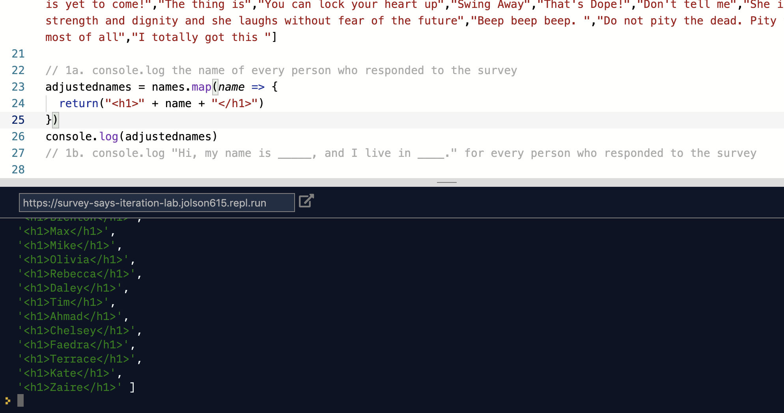

# Survey Says - JavaScript Iteration Lab

## The Goal

The information in the database file attached here has results from a survey Jeff took of some of his friends. He's going to use that information to learn some things about the friends who answered the survey. For example:
* What percent of his friends are programmers?
* Do they like similar or dissimilar music?
* How many of them live in each state?

One warning: these are real people, and real people don't always provide the easiest data to work with. Get ready for typos, unexpected blanks, and outright silliness (Max, for example, isn't 100 years old).

In the `index.js` file, Jeff has written some questions he has. Use your knowledge of for loops, and the `.map()` array method to complete these challenge!

## Getting Started

If you're using an environment like Glitch that focuses on HTML, be sure to open index.html in a web browser and then also open the JavaScript console and confirm that you see "Script Running".

If you're using an environment like Repl.it that focuses on scripting languages, you should be able to push "play" or "run" and see the "Script Running" confirmation in the terminal.

Once you've confirmed that the script runs, open `index.js` and get started on the challenges.

## The Lab

The challenges of this lab are documented directly in the `index.js` as comments.

## Extensions

Exercises 9 and 10 are more complicated than most of the prior ones, and will likely require you to do some additional research and trial and error. 
